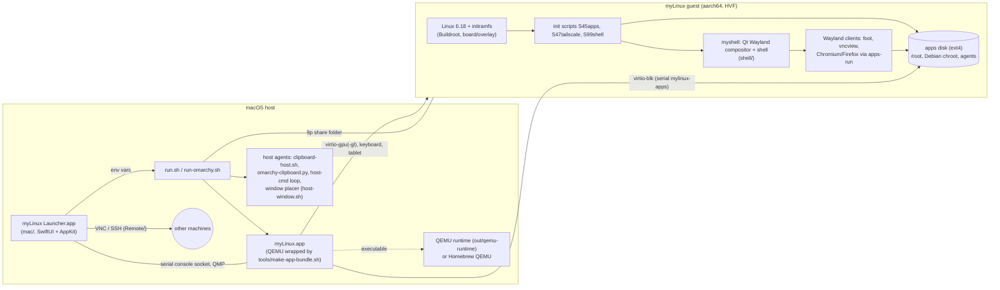

# myLinux architecture

This document describes how myLinux is put together: the parts, how they talk to each other, where state lives,
and which parts are hard. `README.md` is the user guide; `PLAN.md` is the design log with every decision in the
order it was made; `docs/MAC-REMOTE-PLAN.md` covers the launcher's native VNC and SSH. This file is the map between
them. Known weak spots found in the review of 2026-09-24 are in `docs/REVIEW-2026-09-24.md`.

## 1. The system in one picture

myLinux is a small Linux desktop that runs as a QEMU virtual machine on an Apple-silicon Mac. The operating system
is built with Buildroot and lives entirely in RAM (kernel plus an initramfs). Everything that must survive a reboot
lives on a separate disk image, the *apps disk*. The desktop is a Qt 6 Wayland compositor written for this project.
A Mac app, *myLinux Launcher*, keeps machine profiles and starts machines, and can also open VNC desktops and SSH
terminals on other computers natively on the Mac. The same launcher runs a second kind of machine, *Omarchy*
(Arch Linux with Hyprland), from a guest image published by the Try Omarchy project.

## 2. Repository map

| Path | What it is |
|---|---|
| `configs/mylinux_defconfig` | The whole OS definition for Buildroot (toolchain, kernel, packages, rootfs format). |
| `external.desc`, `external.mk`, `Config.in` | Make this repository a Buildroot `BR2_EXTERNAL` tree named `MYLINUX`. |
| `package/` | Local Buildroot packages: `myshell` (the desktop, from `shell/`), `myapp` (from `app/`), `libvterm`, the Inter font. |
| `board/linux.fragment` | Kernel options on top of Buildroot's `qemu/aarch64-virt` config (initrd, 9p, TUN, framebuffer console). |
| `board/overlay/` | Files copied into the root filesystem: init scripts, apps-disk tools, secrets and clipboard helpers, themes, bar-module examples. |
| `patches/qt6wayland/` | Two patches to Qt Wayland Compositor, applied by Buildroot (`BR2_GLOBAL_PATCH_DIR`). |
| `buildroot-patches/`, `tools/buildroot-patch.sh` | A fix to Buildroot's `qt6base.mk` for Qt 6.11's Wayland feature switches; the script applies it, the folder documents it. |
| `shell/` | The desktop: compositor and shell in QML and C++, plus `shell/vncview/`, the in-guest VNC viewer and SSH terminal. |
| `app/` | A small Qt demo app (a clock). |
| `run.sh` | Starts a myLinux machine on the Mac. |
| `run-omarchy.sh` | Starts an Omarchy machine on the Mac. |
| `omarchy/session/` | Session save and restore agent that runs inside Omarchy (installed by the user, systemd user units). |
| `mac/` | myLinux Launcher, a Swift package; `mac/build-app.sh` bundles it. `mac/spike/` is a leftover experiment. |
| `tools/` | Host helpers: app bundling and branding, image and runtime downloads, the QEMU runtime build and its patches, clipboard bridges, window placement, the SDK fast loop, checks and tests. |
| `tools/vmtest/` | Tests that boot a throwaway VM and drive it through QMP and the serial console. |
| `share/` | The default share folder mounted into the guest (development overrides land here). |
| `out/` | Build and download output: `Image`, `rootfs.cpio.gz`, `apps.img`, `myLinux.app`, `qemu-runtime/`, `omarchy/`. Not in git. |

The website that once lived in `web/` has moved to its own private repository; release assets are published in the
public `adminmylinux/mylinux-releases` repository.

## 3. Building the image

**Where it builds.** Buildroot needs a case-sensitive filesystem, so the build runs inside an OrbStack Debian machine
called `debian`. Buildroot 2026.08 is cloned by tag into `~/br/buildroot`, output goes to `~/br/output`, downloads
to `~/br/dl`. `build.sh`, run on the Mac, calls `make` inside Debian through `orb run`, keeps make's real exit
status, and promotes the new `Image` and `rootfs.cpio.gz` into `out/` only as a pair and only after success. The
previous pair is kept as `out/*.prev`. `out/IMAGE-REVISION` and `/etc/mylinux-release` in the image record the git
revision, with `-dirty` when the tree had uncommitted changes.

**What the image contains.** aarch64 with glibc and busybox init; Linux 6.18.7; eudev and libinput; Qt 6.11
(eglfs on KMS, Qt Quick, Qt Wayland Compositor, Qt SVG); Mesa with the llvmpipe and virgl drivers; foot; Tailscale;
the OpenSSH client; curl and e2fsprogs; and the four local packages. The root filesystem is a gzip cpio initramfs
and nothing else: there is no root disk.

**Qt Wayland needs two kinds of fixes.**

- `patches/qt6wayland/0001` raises `wl_seat` to version 5 (pointer frames) and `wl_data_device_manager` to version
  3. foot refuses to start without them. `tools/gen-qt6wayland-patch.py` regenerates this patch.
- `patches/qt6wayland/0002` sends keyboard events to every `wl_keyboard` a focused client has bound, because
  Firefox binds the seat twice. This patch is hand-made.
- `tools/buildroot-patch.sh` edits `qt6base.mk` in the Buildroot checkout so qtbase builds the Wayland features
  Qt 6.11 moved there. Without it qt6wayland builds nothing, silently.

**Fast loop.** `tools/sdk-update.sh` exports the Buildroot SDK once. `tools/app-build.sh shell` then builds
`shell/` (and `vncview`) against it and drops the binaries into `share/`. The guest prefers those copies at the next
shell restart, so a desktop change takes seconds instead of a rebuild.

**Releases.** A release attaches `Image`, `rootfs.cpio.gz` and `SHA256SUMS` to a `v*` release of
`mylinux-releases`. `tools/get-image.sh` resolves one tag, downloads into a staging folder, verifies the checksums
and promotes the pair. The QEMU runtime is released separately under the tag in `tools/qemu-runtime.version`.

## 4. Starting a machine on the Mac

### 4.1 myLinux machines: run.sh

`run.sh` can be run from a terminal or by the launcher. Everything is configured through environment variables
(the header of `run.sh` lists them). It works from any directory, and paths may contain spaces and quotes: the QEMU
command is built as an argument list, never as a string.

1. **Size.** `RES` defaults to the display under the mouse pointer, in points, minus margins. The guest gets it on
   the kernel command line (`mylinux.res=`, `video=Virtual-1:`).
2. **Disks.** The apps disk (`APPS_IMG`, default `out/apps.img`) is created as a sparse file of `APPS_SIZE_GB` if it
   is missing. It is attached as virtio-blk with the serial `mylinux-apps`, which is how the guest recognises it.
3. **Keyboard and pointer.** `GRAB=opt` (default) swaps Option and Cmd inside the guest, so Option is the desktop's
   Super key and macOS keeps Cmd. `GRAB=full` captures every key (needs Accessibility, Ctrl+Option+G releases).
   `MOUSE=tablet` (default) is an absolute pointer that slides in and out; `MOUSE=relative` captures the pointer.
4. **Which QEMU.** `tools/qemu-flavour.sh` picks the accelerated runtime in `out/qemu-runtime` when
   `tools/get-qemu-runtime.sh` installed one, otherwise Homebrew's; the two need slightly different device
   arguments. The runtime is QEMU 11.1.1 with VirGL: guest OpenGL goes through virtio-gpu-gl,
   virglrenderer and ANGLE to Metal on the Mac's GPU. `MYLINUX_QEMU=brew|runtime` and `RENDER=soft` override.
5. **App identity.** `tools/make-app-bundle.sh` wraps the chosen QEMU in `out/myLinux.app` (bundle id
   `dev.mylinux.vm`), so macOS shows "myLinux" in the Dock, the app switcher and the window title. The bundle
   holds a copy of the QEMU binary whose "QEMU" strings `tools/brand-qemu.py` rewrites in the Mach-O file, re-signed
   with the hypervisor entitlement. The bundle is marked non-Retina, so one guest pixel is one point. Launched with no
   arguments from the Dock, that bundle's entry script runs `open mylinux-launcher://start` instead.
6. **Host agents, started beside QEMU and scoped to this machine's share folder and window title.**
   - A loop reads `$SHARE_DIR/host-cmd`, accepts only `fit`, `center`, `fullscreen` and `native`, and passes them
     to `tools/host-window.sh`. Nothing the guest writes is executed as shell.
   - `tools/clipboard-host.sh` mirrors the Mac clipboard into `$SHARE_DIR/clipboard/mac.txt` and copies
     `guest.txt` back to the Mac. `CLIPBOARD=0` turns it off.
   - The placer moves the window onto the display `RES` was computed for, through System Events.
7. **Devices.** virtio-gpu (or virtio-gpu-gl), virtio keyboard and tablet, user-mode networking with optional
   `FORWARD` port forwards to 127.0.0.1, the apps disk, the share folder over 9p (`mount_tag=share`,
   `security_model=none`), and the serial console (a terminal, or a socket for the launcher and tests). `-qmp`
   can be passed through for control.

`DRYRUN=1` prints the QEMU command instead of starting it; the script tests in `tools/tests/scripts.sh` rely on it.

### 4.2 Omarchy machines: run-omarchy.sh

An Omarchy machine is a folder with a raw ext4 root disk and `boot/`, the kernel and initramfs that disk was made
with. `tools/get-omarchy.sh` downloads the Try Omarchy guest once (1.4 GB, one pinned release, checked against a
pinned SHA-256, the publisher's signature and the guest's own checksums; nothing from it runs on the Mac). On the
first start `run-omarchy.sh` unpacks the factory disk, grows it to `DISK_SIZE_GB` (the guest grows its filesystem)
and copies the matching kernel into `boot/`, so a newer download never breaks an existing machine.

The differences from `run.sh`:

- It always uses the accelerated runtime; Hyprland is drawn by the Mac's GPU. The wrapper is a second, Retina-capable
  bundle, `myLinux-omarchy.app` (`dev.mylinux.vm.omarchy`), and the script `exec`s QEMU, so the pid the launcher
  holds is QEMU itself.
- `RES` is the window size in points. On a Retina display the guest gets twice as many pixels and Hyprland scales
  by two. The title bar is a 52-point toolbar instead of a plain 28-point title bar, and the window starts at
  exactly the guest's size.
- The console is `hvc0` on a virtio-serial port, written to a file or a socket. The share folder is mounted with
  the 9p tag `mac` and appears inside Omarchy as `~/<folder name>`.
- A clean stop goes through QMP (`system_powerdown`); myLinux machines are stopped through their serial console.
- The clipboard, text and PNG both ways, runs over a virtio-serial port (`dev.tryomarchy.clipboard`) between
  Omarchy's own clipboard agent and `tools/omarchy-clipboard.py` on the Mac, not through files in the share.
- The window's title bar has size and full screen buttons and a Session menu. They come from
  `tools/qemu-runtime-patches/qemu-cocoa-size-buttons.patch`, this project's own patch to QEMU's Cocoa UI. The
  Session menu runs `tools/omarchy-session-mac.sh`, which drops a command file into the share folder.
- Inside Omarchy, `omarchy/session/omarchy-session` (installed once by the user with `install-session.sh`) saves
  the window layout, each window's command line and a terminal's working directory every minute and at logout, and
  reopens them at login. It also picks up the command files from the Session menu.

## 5. Inside the myLinux guest

### 5.1 Boot sequence

QEMU loads `Image` with the gzip initramfs. Busybox init runs `rcS`, which runs the init scripts in order.

1. Buildroot's own scripts: seedrng, syslog, `S10udevd`, `S40network` (DHCP on the virtio NIC).
2. `S45apps` finds the apps disk by its virtio serial (`usr/lib/mylinux/disk.sh`). It classifies the disk as apps,
   blank, foreign or unreadable and never formats anything by itself. A disk with the apps label is mounted at
   `/mnt/apps` (ext4, `commit=1`) and `/mnt/apps/root` is bound over `/root`. It then runs `apps-mounts prepare`
   (bind mounts and helper files for the chroot) and `apps-path` (see 5.3), and records the result in
   `/run/apps-disk.state` and `/run/apps-disk.info` for the shell's first-run dialog.
3. `S47tailscale` starts tailscaled, with its state on the apps disk, or in `/run` before a disk exists.
4. `S99shell` sets the Qt environment (`profile.d/qt.sh`), mounts the 9p share at `/mnt/share`, merges
   `share/hosts` into `/etc/hosts` (`hosts-sync`), pins the display mode, and starts `myshell` under
   `usr/lib/mylinux/shell-run`, which restarts it after a crash and logs the reason to the share. It also starts
   `clipboard-bridge`. If the share holds an executable `myshell` (from the fast loop), that copy runs instead.

### 5.2 The image and the apps disk

The root filesystem is RAM: it is thrown away at every boot and replaced by every update. That makes updates
atomic and the base system impossible to break by accident, but it means everything personal must live elsewhere.
The apps disk holds:

- the home directory `/root`: settings, `~/.config/mylinux/secrets.env`, `~/.ssh`, the Tailscale identity, user
  themes, bar modules, the viewer's saved machines;
- a full Debian trixie arm64 userland (the "chroot") with apt;
- the coding agents in `/root/.local/bin`.

Plumbing that depends on the image version, the chroot's helper files and bind mounts, is rewritten at every boot
so it follows the image. The disk's contents change only through setup steps.

**First-run setup.** On a blank disk the shell's `FirstRun.qml` offers to set it up. `apps-setup` formats it, then
runs steps that each end with a `stage-<name>-done` marker under `/mnt/apps/.mylinux`, so an interrupted setup
resumes where it stopped:

1. `rootfs`: download a Debian rootfs pinned by commit and SHA-256 (`manifest.env`, `fetch.sh`) and unpack it.
2. `desktop`: apt-install Chromium, Firefox, wl-clipboard and the other desktop packages.
3. `devtools`: git, btop and friends.
4. `ai`: `apps-setup-ai` installs Claude Code through Anthropic's installer and Codex from a pinned release.

A `ready` marker ends it. Disks set up before the markers existed are recognised by what is on them.

### 5.3 Running Debian programs: apps-run

The base system is BusyBox; the real programs live in the chroot. `apps-run <cmd>` runs a command there with
`chroot /mnt/apps env -i ...`, as a Wayland client of the compositor on the host side of the chroot. It keeps the
working directory when it exists in both worlds (`/root`, `/tmp`), passes a clean environment, and hands secrets
only to the programs on its list (coding agents, shells, developer tools; browsers and GUI apps get none), on file
descriptor 3, never on the command line.

`apps-path` makes every Debian command callable from a host terminal: it creates shims in `/usr/local/bin` that go
through `apps-exec`, with the base system taking priority. Wrappers such as `firefox`, `files` and `remmina` go
through `apps-install`, which installs the package on first use.

### 5.4 Secrets and the share folder

`secrets.env` holds `KEY=value` lines with mode 0600. It is always read as data, never sourced as shell.
`usr/lib/mylinux/secrets.sh` validates the lines; `profile.d/secrets.sh` exports them into interactive shells; the
shell's Settings panel writes API keys there, and the in-guest VNC viewer writes machine passwords there too.

The share folder is a Mac folder mounted over 9p at `/mnt/share` and bound into the chroot. It is the channel for
everything that crosses between Mac and guest without a network:

| In the share | Direction | Purpose |
|---|---|---|
| `mylinux.ini` | both | Shell settings (QSettings ini), editable on the Mac. |
| `clipboard/mac.txt`, `clipboard/guest.txt` | Mac to guest, guest to Mac | Text clipboard. |
| `host-cmd` | guest to Mac | Window requests (fit, center, fullscreen, native), allowlisted. |
| `hosts` | Mac to guest | Extra host names merged into `/etc/hosts` at boot. |
| `diag-request`, `diag.json` | both | Test hooks: the compositor dumps its window inventory. |
| crash logs | guest to Mac | Why the shell died last time. |
| `myshell`, `vncview`, `myapp` | Mac to guest | Development overrides from the fast loop. |
| `mylinux-tools/` (Omarchy) | both | The session agent's files and the Session menu's command files. |

## 6. The desktop shell (shell/)

### 6.1 Process model

`myshell` is one Qt 6 process that is both the Wayland compositor and the whole desktop: menu bar, dock, window
frames, launcher menu, panels. It renders with eglfs on KMS (`shell/main.cpp`). Every app is an ordinary Wayland
client on `wayland-0`: foot, vncview, the demo clock, and Chromium or Firefox from the chroot. `Launcher::launch`
starts clients detached, with a cleaned environment (`QT_QPA_PLATFORM=wayland`, no client-side decorations) and
their output in `/var/log/apps.log`.

### 6.2 Compositor and window model

- `Main.qml` holds the `WaylandCompositor` with one output whose window is `Desktop`, the `XdgShell`, and the
  `XdgDecorationManagerV1` that asks clients to let the server draw decorations. It sets the xkb keymap and runs
  autostart, including `vnc --restore` when the viewer left a session file.
- `Desktop.qml` owns the window list, nine workspaces with a dwindle tiling tree each (`Tiling.qml`), the scratchpad,
  keyboard focus, every keyboard shortcut, the input grab for the VNC viewer, and the test diagnostics.
- `MacWindow.qml` wraps one `xdg_toplevel` in a `ShellSurfaceItem` and draws the macOS-style title bar, the resize
  handles and the terminal settings popover. It is the one place that builds xdg configure events (activated,
  maximized, fullscreen, tiled states and sizes).
- The chrome: `MenuBar.qml`, `Dock.qml`, `Spotlight.qml` (the launcher menu and search), `KeyHelp.qml` (the
  keybinding sheet), `FirstRun.qml`, and the popovers `DisplayPanel`, `SettingsPanel`, `TailscalePanel` and
  `AgentPanel`. `GlassPanel.qml` blurs the desktop behind panels in software.
- `Theme.qml` is a singleton for the UI scale and text scale (`px()`, `fpx()`), the palette and the look toggles.

UI scaling is done by scaling the client's item, not by the Wayland output scale, which stays 1. foot is the
exception: it is told a larger font size, so terminal text stays sharp at any scale.

### 6.3 C++ singletons

Each is registered as a QML singleton and does one job.

| Singleton | Job |
|---|---|
| `Settings` | QSettings ini at `/mnt/share/mylinux.ini`, or in `/tmp` when the share is missing. |
| `Secrets` | Reads and writes `secrets.env` for the Settings panel. |
| `ThemeStore` | Finds themes in `/usr/share/mylinux/themes` and `~/.config/mylinux/themes` (Omarchy format), writes foot's config, recolours running terminals, converts WebP backgrounds in a thread pool. |
| `KeyGrab` | An application-wide event filter: Super+digit by key code, the modifiers currently held (the keybinding sheet highlights them), standing down during a VNC grab. |
| `Launcher` | Starting processes, small file reads and writes for QML, seat focus. |
| `BarModules` | Omarchy-style menu bar modules from `~/.config/mylinux/bar/modules`: command modules run through `apps-run sh -c`, QML modules loaded into the bar, all reloaded when the folder changes. |
| `Http`, `Weather` | GET requests for QML modules; the weather item (Open-Meteo). |
| `Tailscale` | `tailscale status --json` with a watchdog, for the Tailscale panel. |
| `AgentUsage` | Scans Claude Code and Codex logs on a worker thread (with a per-file cache) and probes the usage limits, for the agent panel. |

### 6.4 vncview

`shell/vncview/` is a separate Qt Quick client with app id `vncview`. The compositor hands it every key and the
pointer while it is fullscreen or after ⌘⌃G.

- `VncSession` runs libvncclient on its own `QThread`; decoded rectangles are copied into a front buffer under a
  mutex, and input is queued back to that thread.
- `VncSurface` paints the framebuffer, handles zoom and panning, and maps keys to X keysyms.
- `VncCert` does trust-on-first-use pinning of VeNCrypt X509 certificates.
- `SshSession` runs OpenSSH on a pty (`forkpty`) into libvterm and answers the first password prompt;
  `TermSurface` paints the cell grid.
- `Machines` keeps `~/.config/mylinux/vnc/machines.json`, the passwords (in `secrets.env`) and `session.json`,
  the open tabs that come back after a restart.

## 7. The Mac launcher (mac/)

### 7.1 Core

- `App.swift`: the scenes (the machines window, Settings), menu commands (⌘N, ⌘⇧N for Omarchy, ⌘K), the app
  delegate (URL handling, the quit confirmation, session restore) and `QuickStart`, which starts the last-used
  machine for the Dock icon.
- `Paths.swift`: `AppSettings` and the two modes. In developer mode, `run.sh`, `tools/` and `out/` come from a
  checkout chosen in Settings. In standalone mode, the scripts come from the app bundle and images are downloaded
  into `~/Library/Application Support/myLinux`.
- `Profile.swift`: `Profile` (kind `mylinux` or `omarchy`) and `ProfileStore` (`profiles.json`). Its
  `environment()` is the only mapping from the form to the scripts' variables.
- `ImageManager.swift`: downloaders that run `get-image.sh`, `get-qemu-runtime.sh` and `get-omarchy.sh` and show
  their progress.
- `ContentView.swift`, `MachineView.swift`, `ConsoleView.swift`: the sidebar, the machine form and the serial
  console.
- `StatusMenu.swift`: the menu bar item, the mouse's way out of a full keyboard grab.

### 7.2 How it runs a machine

`Runner` (one per profile, kept by `RunManager` in `Runner.swift`) starts `/bin/sh run.sh` or `run-omarchy.sh`
with the profile's environment. Output goes to a log file, not a pipe, so a machine outlives the launcher. The
guest console is a unix socket that the runner reads into the console view. Shut Down types `poweroff` into that
console for myLinux and sends QMP `system_powerdown` for Omarchy; Force Quit kills QEMU. A timer runs `pgrep` over
QEMU command lines every few seconds to find machines started elsewhere and attach to their console.

`build-app.sh` builds the package in release mode and assembles `out/mac/myLinux Launcher.app` with copies of
`run.sh`, `run-omarchy.sh`, the helpers from `tools/`, `omarchy/session` and the icons. It is signed with a local
certificate when the keychain has one, so the Accessibility permission the full keyboard grab needs survives
rebuilds, and ad hoc otherwise.

### 7.3 URL schemes and the Dock

| URL | Sent by | Effect |
|---|---|---|
| `mylinux-launcher://start` | the myLinux icon in the Dock | Start the last-used machine, or bring it forward. |
| `mylinux://vnc/<name>`, `mylinux://ssh/<name>`, `mylinux://remote/<name or id>` | Shortcuts, scripts, `open` | Open a saved remote machine, matched by name, then host, then id. |
| `mylinux-launcher://remote/<id>` | older builds | Same as `mylinux://remote/`. |

### 7.4 The remote stack

The launcher can open VNC desktops and SSH terminals straight from the Mac, so there is one keyboard owner
between the user and the remote machine, not two. It is layered like this:

1. **Profiles and secrets** (`RemoteProfile.swift`): `remote.json`, the store, and Keychain items. Items are
   written through `/usr/bin/security` so the ssh askpass helper can read them without a prompt.
2. **VNC transport** (`VncConnection.swift`): libvncclient on its own thread, decoding straight into an IOSurface
   (or through a staging buffer when rows are padded), with state reported on the main queue.
   `CertPin.swift` and `TLSPeek.swift` fetch the server certificate over their own VeNCrypt handshake, show it for
   trust on first use, pin it as PEM under `vnc-certs/`, and let libvncclient verify against it.
3. **Picture and input** (`VncView.swift`, `KeyMap.swift`): a CALayer showing the surface, zoom that follows the
   pointer, trackpad scrolling and pinch, and layout-aware keysym translation.
4. **Keyboard grab** (`KeyboardGrab.swift`): for "Everything to the remote", an HID event tap takes every key,
   ⌘Tab and ⌘Space included. It forwards only while the owning window is key and the app is active. A watchdog
   checks that every second, Ctrl+Option+G releases it, and the menu bar item releases it with the mouse.
5. **SSH** (`SshTerminal.swift`): SwiftTerm over `/usr/bin/ssh`, with an askpass script that reads the Keychain,
   optional key file and `tmux new-session -A`.
6. **Windows and sessions** (`RemoteWindow.swift`, `RemoteSession.swift`, `QuickConnect.swift`,
   `RemoteEditor.swift`): one native tabbed window per connection, with a toolbar, password and trust sheets and a
   status line; the list of open windows is remembered in `remote-session.json` and restored at launch; ⌘K quick
   connect; import from the guest viewer's `machines.json`.

## 8. Where state lives

| State | Location | Written by | Lifetime |
|---|---|---|---|
| Machine profiles | `~/Library/Application Support/myLinux/profiles.json` | launcher | permanent |
| Remote profiles, open remote windows | `…/myLinux/remote.json`, `…/remote-session.json` | launcher | permanent / until closed on purpose |
| Remote passwords | macOS Keychain, service "myLinux Remote" | launcher | permanent |
| VNC certificate pins | `…/myLinux/vnc-certs/<host>_<port>.pem` | launcher | permanent |
| Kernel and rootfs | `out/` or `…/myLinux/image/` | build.sh, get-image.sh | replaced by updates |
| Apps disk | `out/apps.img` or a machine folder | run.sh (creates), guest (fills) | permanent |
| Shell settings | `share/mylinux.ini` | shell, user | permanent |
| API keys, viewer passwords | `/root/.config/mylinux/secrets.env` on the apps disk | shell, vncview | permanent |
| Viewer machines and tabs | `/root/.config/mylinux/vnc/machines.json`, `session.json` | vncview | permanent / until closed on purpose |
| Themes, bar modules | `/root/.config/mylinux/themes`, `…/bar/modules` | user, theme-install | permanent |
| Setup progress | `/mnt/apps/.mylinux/stage-*-done`, `ready` | apps-setup | permanent |
| Disk and setup status for the UI | `/run/apps-disk.*`, `/run/apps-setup.status` | S45apps, apps-setup | this boot |
| Omarchy root disk and kernel | machine folder: `omarchy.ext4`, `boot/` | run-omarchy.sh | permanent |

## 9. Testing

| Command | What it covers | Needs |
|---|---|---|
| `tools/check.sh` | Shell syntax, Python syntax, QML lint (through the SDK), the two script suites, the Swift tests. | Nothing special; QML lint needs OrbStack. |
| `tools/tests/scripts.sh` | Host scripts: failed builds and downloads keep the old image, paths with spaces and quotes, `DRYRUN` output, bundle branding. | — |
| `tools/tests/guest.sh` | Guest script libraries run on the Mac: disk detection, secrets, downloads, themes, clipboard, crash reports. | — |
| `swift test --package-path mac` | Launcher: profile format and migration, keysyms, certificate parsing, the status menu, sessions, links, import, quick connect. | Homebrew libvncserver |
| `tools/vmtest/vmtest.py` | Boots the throwaway test VM (`out/apps-fresh.img`, `out/fresh-share`) and runs about 30 scenarios: typing, focus, tiling, fullscreen, clipboard, menus, bar modules, the VNC viewer, SSH tabs, shell restart. | A built image, the test disk |
| `tools/vmtest/disktest.py` | Apps disk classification and interrupted setup. | A built image |
| `tools/mac-remote-test.sh` | The launcher's native VNC and SSH against the test VM, with ports forwarded. | Debug launcher build |

The VM tests assert on a JSON dump of the compositor's window inventory (`diag.json`), which the shell writes when
`[test] diag=true` is set in the test share's `mylinux.ini`. They drive input through QMP and commands through the
serial console. They never touch the user's own disk or share.

## 10. What is complicated, and why

These are the parts that take the most care to change. Each has broken before or is easy to break.

**Focus and window state in the compositor.** Wayland leaves window management to the compositor, so
`Desktop.qml` and `MacWindow.qml` decide who gets keys, when, and what each client is told about its state. Focus
is deferred until a client has drawn its first buffer; helper surfaces (the invisible windows `wl-copy` makes) are
recognised by heuristics; the "activated" state must follow focus exactly or apps draw themselves wrong; and
fullscreen, maximised, tiled and floating are four states that each change the configure events. The VM suite
exists mainly to keep this honest.

**Three layers of key handling.** A key can be taken by a QML `Shortcut`, by `KeyGrab` (by key code, so it works on
any layout), or passed through to a client; during a VNC grab both shortcut layers must stand down. On the Mac side
there are three more layers above that: macOS, QEMU's Cocoa UI with its `GRAB` mode, and for the launcher's own
viewer an HID event tap. A stuck event tap would take the whole Mac's keyboard, which is why it has a watchdog,
a key combination and a menu bar escape.

**Two scaling schemes.** The shell scales client surfaces as items (fractional scales such as 0.75x work, but
anything above 1x is a scaled bitmap), while foot scales its own font for sharp text. Every hard-coded pixel size
in the chrome shows up at 0.5x or 2x. On the Omarchy side the Retina factor is decided by run-omarchy.sh and
Hyprland instead.

**A RAM root filesystem with a persistent disk beside it.** It makes updates atomic, but every piece of state
must be placed deliberately, the chroot's plumbing must be rebuilt at each boot, and the apps disk has its own
lifecycle: blank, setting up, interrupted, ready, from an older release, damaged by a power cut. Setup resumes by
stage markers, and older disks are recognised by their contents, and those two rules interact. There is no disk
migration between releases yet.

**Two userlands.** The base system is BusyBox and glibc from Buildroot; the apps are Debian in a chroot. Paths,
environment, working directory, time zone, DNS settings and secrets all have to be carried across the boundary
explicitly by `apps-run`, `apps-mounts` and `apps-path`. Everything runs as root, so the chroot is a convenience,
not a security boundary.

**Secrets in one file, written by two programs.** `secrets.env` is written by the shell's Settings panel and by
vncview, read by `apps-run` and every interactive shell, and must stay 0600 and data-only. That gives it several
readers and writers without a shared library or a lock.

**The share folder as a message bus.** Clipboard, window requests, settings, diagnostics, crash logs, development
binaries and the Omarchy session commands all travel as files over 9p. It needs no network and no guest agent, but
every channel needs its own care: allowlists on the Mac side, atomic writes, instance isolation when two machines
run, and trust, because whatever lands in the share can influence what runs in the guest.

**Patched upstream code.** Qt Wayland Compositor carries two local patches tied to Qt 6.11.1, Buildroot needs a
local edit, and QEMU's Cocoa UI carries this project's own patch on top of Try Omarchy's pinned runtime build. Each
upgrade of Qt, Buildroot or the runtime means re-checking these by hand.

**QEMU as an app.** macOS knows QEMU only as a binary, so run.sh wraps it into a branded bundle (rewriting strings
inside the Mach-O file, which depends on its layout), places its window through System Events by window title,
and talks to it through a serial socket, QMP and files. Window sizes combine 1x and Retina bundles, two title-bar
heights and a fixed window versus Zoom To Fit. The launcher learns which machines
run by reading QEMU command lines, which ties it to exactly how each script formats its arguments.

**libvncclient in two places.** The guest viewer (C++, a QThread) and the Mac viewer (Swift, raw C callbacks into
an IOSurface that Core Animation reads) both drive a C library that calls back on its own thread, blocks in
reads, and can change the framebuffer size mid-session. Certificate pinning spans a separate handshake, a CA file
handed to the library, and the list of security types the client accepts, and is only as strong as the weakest
of the three.

**The build environment is partly outside git.** The configured defconfig in `~/br/output`, the saved
`BR2_EXTERNAL` path, the Buildroot edit and files left in `output/target` all affect what gets built.
`build.sh` records the git revision of this repository but not the Buildroot state.
