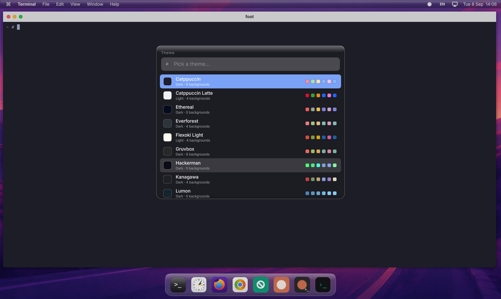

# myLinux

A small Linux desktop that lives entirely in RAM, built for Apple-silicon Macs.
It boots in a few seconds as a QEMU virtual machine (Apple's Hypervisor.framework), runs a
Qt 6 Wayland compositor with a macOS-style look (menu bar, dock, glass panels) and borrows its
keyboard-driven workflow and themes from [Omarchy](https://omarchy.org): tiling windows,
Super+Space launcher, Super+K keybinding sheet, Omarchy theme packs and backgrounds.

Persistent things (your home directory, Debian apps, browsers, Claude Code, Codex) live on a
separate "apps disk" image that the system sets itself up on first boot.



## What is inside

| Layer | Choice |
|---|---|
| Build system | [Buildroot](https://buildroot.org) 2026.08, this repo is the `BR2_EXTERNAL` tree |
| Target | arm64, Linux 6.18, glibc, busybox init, initramfs only (~110 MB kernel + rootfs) |
| Graphics | virtio-gpu, Mesa llvmpipe, Qt 6.11 `eglfs_kms` |
| Desktop | `shell/`: QML Qt Wayland Compositor ("myshell"), foot terminal, Inter font |
| Apps disk | Debian trixie arm64 chroot with apt: Chromium, Firefox, git, Claude Code, Codex, wl-clipboard |
| Host | QEMU 11 (Homebrew), HVF acceleration, 9p shared folder, macOS app bundle `myLinux.app` |

## Requirements

- Apple-silicon Mac, macOS 15 or newer, about 8 GB of free RAM for the VM.
- [Homebrew](https://brew.sh) with `brew install qemu`.
- To build the image: [OrbStack](https://orbstack.dev) with a Debian machine named `debian`
  (Buildroot needs a case-sensitive filesystem; the build tree lives inside Debian at `~/br`).
  Prebuilt images are attached to the GitHub releases, so building is optional.

## Install and run (prebuilt image)

```bash
brew install qemu
git clone https://github.com/adminmylinux/mylinux.git
cd mylinux
tools/get-image.sh      # downloads Image + rootfs.cpio.gz of the latest release into out/, checks SHA256
./run.sh
```

`run.sh` wraps QEMU in `out/myLinux.app` so the Mac shows it as "myLinux". The window opens at the
size of the display under your mouse pointer; if the first start puts it on another display, give your
terminal app Accessibility permission (System Settings › Privacy & Security) and it is moved automatically.

The first boot shows a welcome dialog. "Set up the apps disk" formats the blank
`out/apps.img` (a sparse 16 GB file created by `run.sh`), downloads Debian's minimal rootfs
and installs the desktop apps plus Claude Code and Codex. It takes a few minutes and uses
about 1.3 GB. Everything you install or save afterwards persists on that disk.

Useful environment variables for `run.sh`: `RES=1600x1000` guest resolution (default is your
screen minus margins), `MEM=8G`, `APPS_IMG=path`, `SHARE_DIR=path`, `GRAB=opt|full|none`.

## Keys

The Mac **Option** key is the Super key inside myLinux (Cmd stays with macOS).
Press **Option+K** for the full list.

| Keys | Action |
|---|---|
| Option+Space | Launcher (type to filter; `=` calculator, `install <pkg>` apt) |
| Option+Enter / Option+Shift+Enter | Terminal / Browser |
| Option+W, Option+Q, Option+M, Option+F | Close, quit, minimise, fullscreen |
| Option+Arrows, Option+Shift+Arrows, Option+Ctrl+Arrows | Focus, swap, resize tiles |
| Option+V, Option+Shift+T | Float/tile a window, tiling on/off |
| Option+Ctrl+Shift+Space | Theme picker |
| Option+Ctrl+Space | Next background |

### Quitting

Use **Shut Down…** (or **Restart…**) from the  menu at the top left, or type `shut` into the
⌘K sheet. That unmounts the apps disk cleanly. Closing the myLinux window or pressing Cmd+Q on the
Mac side is a power cut for the virtual machine: the disk is journalled and flushed every second, so
you lose at most about a second of writes, but a clean shutdown is the safe habit.

### Terminal

Option+Enter opens a terminal in your home directory (`/root`, on the apps disk). The base system is
BusyBox; everything installed on the apps disk is on the PATH as well, so `claude`, `codex`, `git`,
`python3`, `apt install …` just work (they run inside the Debian chroot, in the same directory). For a
full Debian shell type `apps-run bash`.

## Themes (Omarchy compatible)

Themes use Omarchy's format: a directory with `colors.toml`, optional `light.mode` and a
`backgrounds/` folder. Twenty Omarchy palettes ship in the image with generated wallpapers.

- Theme picker: "Download Omarchy backgrounds for all themes" fetches the real Omarchy photos
  (about 70 MB) into your home on the apps disk.
- Install any Omarchy theme repo from GitHub: type `install owner/repo` in the theme picker, or
  run `theme-install https://github.com/owner/repo` in a terminal.
- Your own themes go in `~/.config/mylinux/themes/<name>/`.

## Build the image yourself

Inside the Debian machine (`orb -m debian`):

```bash
sudo apt install -y build-essential git cmake ninja-build python3 rsync bc wget cpio unzip file \
  libncurses-dev libssl-dev bzip2 xz-utils zstd perl-modules ccache gawk texinfo patch
mkdir -p ~/br && cd ~/br && git clone --branch 2026.08 --depth 1 https://gitlab.com/buildroot.org/buildroot.git
mkdir -p ~/br/output ~/br/dl
```

Then from the Mac, in this repo:

```bash
tools/buildroot-patch.sh        # small Buildroot fix for Qt 6.11 wayland features
orb run -m debian sh -c "cd ~/br/output && make O=\$PWD BR2_EXTERNAL=$PWD -C ~/br/buildroot mylinux_defconfig"
./build.sh                      # first build ~1 h on 13 cores (toolchain, Qt, Mesa, kernel), later builds minutes
```

Fast loop for the desktop shell without rebuilding the image:

```bash
tools/sdk-update.sh             # once: export the Buildroot SDK
tools/app-build.sh shell        # builds shell/ into share/myshell, the VM picks it up on next shell restart
```

`PLAN.md` documents every design decision and milestone in detail.

## Layout

```
configs/mylinux_defconfig   the whole OS definition
board/                      kernel fragment and rootfs overlay (init scripts, apps-disk tools, themes)
package/                    Buildroot packages: myshell, myapp, inter
shell/                      the Qt Wayland compositor (C++ + QML)
app/                        small Qt demo app (clock)
patches/                    Qt Wayland compositor patch (wl_seat v5, data device v3)
tools/                      build, SDK, apps-disk, automation helpers
run.sh / build.sh           run on the Mac / build inside Debian
```

## License

GPL-3.0-or-later (see `LICENSE`). The desktop shell links the Qt Wayland Compositor module,
which Qt offers under the GPL v3 only. Theme palettes are from Omarchy (MIT, see
`board/overlay/usr/share/mylinux/themes/LICENSE.omarchy`); the Inter font is under the SIL OFL.
