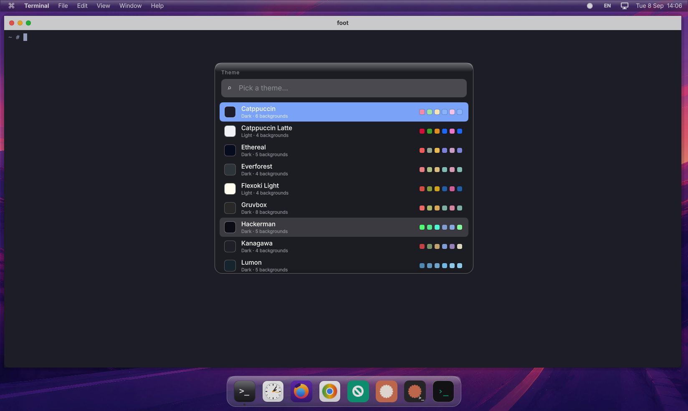

# myLinux

A small Linux desktop that lives entirely in RAM, built for Apple-silicon Macs.
It boots in a few seconds as a QEMU virtual machine (Apple's Hypervisor.framework), runs a
Qt 6 Wayland compositor with a macOS-style look (menu bar, dock, glass panels) and borrows its
keyboard-driven workflow and themes from [Omarchy](https://omarchy.org): tiling windows,
Super+Space launcher, Super+K keybinding sheet, Omarchy theme packs and backgrounds.

Persistent things (your home directory, Debian apps, browsers, Claude Code, Codex) live on a
separate "apps disk" image that the system formats on first boot; apps install onto it when first opened.



## What is inside

| Layer | Choice |
|---|---|
| Build system | [Buildroot](https://buildroot.org) 2026.08, this repo is the `BR2_EXTERNAL` tree |
| Target | arm64, Linux 6.18, glibc, busybox init, initramfs only (~110 MB kernel + rootfs) |
| Graphics | virtio-gpu, Qt 6.11 `eglfs_kms`; Mesa virgl on the accelerated QEMU runtime (the Mac's GPU through Metal), Mesa llvmpipe on Homebrew's QEMU |
| Desktop | `shell/`: QML Qt Wayland Compositor ("myshell"), foot terminal, Inter font |
| Apps disk | Debian trixie arm64 chroot with apt: Chromium, Firefox, Remmina (VNC/RDP), btop, git, Claude Code, Codex, wl-clipboard |
| Host | QEMU 11 (Homebrew), HVF acceleration, 9p shared folder, macOS app bundle `myLinux.app` |

## Requirements

- Apple-silicon Mac, macOS 15 or newer, about 8 GB of free RAM for the VM.
- [Homebrew](https://brew.sh) with `brew install qemu`.
- To build the image: [OrbStack](https://orbstack.dev) with a Debian machine named `debian`
  (Buildroot needs a case-sensitive filesystem; the build tree lives inside Debian at `~/br`).
  Prebuilt images are attached to the releases of the public
  [mylinux-releases](https://github.com/adminmylinux/mylinux-releases) repository, so building is optional.

## Install and run (prebuilt image)

```bash
brew install qemu
git clone https://github.com/adminmylinux/mylinux.git
cd mylinux
tools/get-image.sh      # downloads Image + rootfs.cpio.gz of the latest release into out/, checks SHA256
./run.sh
```

Homebrew's QEMU is optional: `tools/get-qemu-runtime.sh` installs myLinux's own QEMU into `out/qemu-runtime`
(about 15 MB), and `run.sh` uses it whenever it is there. That runtime is QEMU 11.1 with VirGL, so a guest whose
Mesa has the `virgl` driver renders on the Mac's GPU (virtio-gpu-gl, virglrenderer, ANGLE, Metal): images built
after 2026-09-19 do, and the desktop's compositor then costs a few percent of a core where software rendering took two
and a half cores for a repainting terminal. `RENDER=soft ./run.sh` keeps the guest on software GL. `MYLINUX_QEMU=brew ./run.sh` insists on Homebrew's, `tools/get-qemu-runtime.sh --remove`
goes back for good. It is built by `tools/build-qemu-runtime.sh` from a pinned commit of
[Try Omarchy](https://github.com/omacom/try-omarchy)'s runtime build; sources and licences travel inside it (`NOTICES.md`).
Since 11.1.1-17 it also holds a PC emulator (`qemu-system-x86_64`, the same source built with TCG, with SeaBIOS in
`share/qemu`) and `mke2fs`. They were added for Puppy Linux machines (launcher 0.7.54 only: a PC system, too slow
emulated to keep); Tiny Alpine makes its disks with `mke2fs`, nothing uses the PC emulator now.

### Omarchy machines

The same runtime also starts real [Omarchy](https://omarchy.org) (Arch Linux with Hyprland) as a second kind of
machine: `tools/get-omarchy.sh` downloads the ARM64 guest that the [Try Omarchy](https://github.com/omacom/try-omarchy)
project publishes (1.4 GB, one pinned release, checked against a pinned SHA-256, the publisher's signature and the
guest's own checksums; nothing from it is run on the Mac), and `./run-omarchy.sh` boots it with Hyprland drawn by the
Mac's GPU. A machine is a folder holding its root disk (unpacked on first start, `DISK_SIZE_GB=32`, grown by the guest)
and `boot/`, the kernel that disk was made with. `SHARE_DIR=~/Work` shows up inside as `~/Work`; `GRAB`, `MEM`, `RES`
work as for `run.sh`; `QMP=socket` gives a control socket, where `system_powerdown` is a clean shutdown. The window's
title bar has four buttons at the right: 10% smaller, 10% larger (Omarchy follows with a lower or higher
resolution; myLinux's window has the same buttons since runtime 11.1.1-3, and its desktop is zoomed), Fill Screen
(since runtime 11.1.1-18, as in the terminal windows: the whole screen below the menu bar, and the size before when
pressed again) and full screen. From launcher 0.7.59 a desktop's window opens filling the screen (no margin around
it: `run.sh` and `run-omarchy.sh` measure the title bar's height and give the guest what is left), so the first boot
screen is full size too; `RES` or the machine's Screen setting still chooses another size.
Since runtime 11.1.1-4 the window is resizable from the start, so Window › Fill, the green button's tiling and a
drag work straight away; until you size it, it follows the guest's resolution as a fixed window did; Control+Command+F toggles full screen in every keyboard mode, and a small floating
box with an exit button appears while in full screen. They come from `tools/qemu-runtime-patches/`, myLinux's own
patch on the runtime. In the
launcher it is **Add Omarchy**. Open windows come back after a restart: `omarchy/session` is written into a new
machine's disk before its first boot (`tools/omarchy-bake-session.sh`, with the runtime's `debugfs`; nothing is mounted),
system-wide and enabled for every account. The layout, each window's command line and a terminal's working directory, is
saved every minute and at logout and reopened on the same workspaces at login. Apps that restore their own state come
back complete, terminals come back empty in the right folder. `omarchy-session status|save|restore|interval|disable`
inside Omarchy; on a machine made before this existed, `sh ~/<share>/mylinux-tools/install-session.sh` installs it into
the account (run-omarchy.sh puts the files in the share folder as `mylinux-tools/`), and `install-session.sh --remove`
takes it out. The Session menu in the middle of the window's title bar (and in the
floating box in full screen) saves, restores and sets how often the layout is saved; it hands the command to the
tool through the share folder. The clipboard is shared both ways, text and PNG images, through
Omarchy's own clipboard agent and, on the Mac, the launcher's own binary in a helper mode
(`myLinux Launcher --omarchy-clipboard <socket>`, which the app hands to run-omarchy.sh as `MYLINUX_HELPER`; from the
command line without the app, `tools/omarchy-clipboard.py` when a working python3 is there). `CLIPBOARD=0` turns it
off. New Omarchy machines in the launcher send every key to Omarchy with Command as Super (`GRAB=full`); the
machine page switches to Option. Neither a machine's first start nor a download needs python3. Not there
(they need Try Omarchy's own helper app): camera and Touch ID; sound plays through the Mac's default output.

### Arch Linux machines (KDE Plasma)

A third desktop: Arch Linux ARM with KDE Plasma (Wayland), signed in automatically as `arch` (sudo without a
password), with Konsole, Dolphin, Kate, Firefox and PipeWire sound. There is no ready-made Arch desktop image for Apple
silicon, so myLinux builds one: `tools/build-arch-image.sh` runs as root on an arm64 Linux (the OrbStack `debian`
machine: `orb -m debian sudo bash tools/build-arch-image.sh`), checks Arch Linux ARM's root filesystem against its
build key, installs the packages with pacman, and leaves the kernel, initramfs (virtio drivers, not fitted to the
build machine) and a zstd-compressed raw ext4 root in `out/arch-build`, laid out as Omarchy's guest is. Releases go to
mylinux-releases as `arch-<date>`; `tools/get-arch.sh` downloads the pinned one (its SHA256SUMS checked against a
pinned SHA-256, the files against SHA256SUMS). `DESKTOP=arch ./run-omarchy.sh` starts it on the same runtime and
window as Omarchy (size buttons, keyboard modes, QMP, sound), without Omarchy's session agent. The Mac share is
mounted by the guest's fstab at `/mnt/mac` (`~/Mac`); `mylinux.scale=2` on the kernel command line sets Plasma's scale
on a Retina display (`arch/mylinux-scale`, at sign-in). The clipboard goes through `arch/mylinux-clipboard`, an agent
inside that speaks Try Omarchy's protocol on the same virtio port, so the launcher's bridge serves both desktops. In
the launcher it is **Arch Linux Machine**; new ones keep ⌘ with the Mac and use Option as Meta (`GRAB=opt`).

### Kali Linux machines (Xfce)

A fourth desktop: [Kali Linux](https://www.kali.org) with its own default desktop, Xfce, signed in automatically as
`kali` (password `kali`, sudo without one), with QTerminal, Thunar, Firefox and Kali's top tools
(`kali-tools-top10`: nmap, Metasploit, Wireshark, John, Hydra, sqlmap, aircrack-ng, NetExec and Responder; Burp
Suite, the tenth, is not built for arm64); the
snippet **Kali's default tools** installs the full set a Kali installation has. Kali publishes an installer for arm64
but no ready-made virtual machine, so myLinux builds the image, as it does Arch's: `tools/build-kali-image.sh` runs
as root on an arm64 Linux (`orb -m debian sudo bash tools/build-kali-image.sh`), bootstraps `kali-rolling` from
Kali's own archive with `debootstrap` (the packages checked against Kali's archive signing key, whose keyring is
checked against the fingerprint kali.org names), installs the packages and leaves a kernel, an initramfs and a
zstd-compressed raw ext4 root in `out/kali-build`. Releases go to mylinux-releases as `kali-<date>`;
`tools/get-kali.sh` downloads the pinned one, and `DESKTOP=kali ./run-omarchy.sh` starts it on the same runtime and
window as Omarchy and Arch (the ⌘ menu, the size buttons, keyboard modes, QMP, sound, the Mac share at `~/Mac`).
Xfce runs on X11, which draws in software here (`kali/20-mylinux-modesetting.conf`: X's own OpenGL acceleration on
QEMU's virgl gave a black screen), and [`kali/`](kali/) holds what Plasma does by itself in Arch: `mylinux-desktop` (started at
sign-in) makes the desktop follow the window's size (it takes the display's new preferred mode at every change),
sets Xfce's scale on a Retina display and keeps the clipboard agent running (`mylinux-clipboard`, for X11 with
`xclip`, speaking the same protocol as Omarchy's and Arch's). The power button shuts down without asking, nothing
locks or blanks the screen, and the root file system grows to the machine's disk size at each start. In the
launcher it is **Kali Linux Machine**. The image is myLinux's own build from Kali's packages, not an official Kali
image.

### Debian server machines

The third kind of machine is a plain Debian server with no window at all: the latest stable Debian (trixie) from
its official arm64 cloud image, for anything that only needs a terminal. `tools/get-debian.sh` downloads the image
(about 300 MB, checked against Debian's SHA512SUMS; the raw disk is kept sparse in `out/debian`) and the UEFI
firmware it boots with (the edk2 build QEMU itself ships, from the runtime's pinned QEMU commit, by checksum), and
`./run-debian.sh` boots it on the runtime or Homebrew's QEMU. Each machine has its own disk, copied from the image
on the first start and grown to `DISK_SIZE_GB` (cloud-init grows the root filesystem into it), and is set up by
cloud-init from a seed made on the Mac: the `debian` account with sudo, an SSH key generated for the machine
(`ssh_key` beside the disk), a random console password (`console-password`, for the serial console), the machine's
name as its host name, and the share folder mounted at `/mnt/mac` and linked from the home folder. SSH is forwarded
to `SSH_PORT` on 127.0.0.1 (default 2223; `FORWARD=host:guest` adds more ports), the serial console goes to `SERIAL`,
and `QMP` gives the socket a clean `system_powerdown` uses. In the launcher it is **Debian Server**: the machine
page has the settings, the Console tab the serial console, and Start opens an SSH terminal with the machine's key
as soon as its sshd answers (the Terminal button opens it again). That terminal window has **Find and Run** on ⌘Space, as Super+Space in Omarchy (`Remote/SpaceHotkey.swift`: the
launcher's event tap, with the Accessibility permission Omarchy's "every key" mode uses, takes ⌘Space only while a
server's window is in front; Spotlight keeps it everywhere else; Settings › Terminal turns it off) and on ⌥Space: a search over the programs installed on the machine, read over ssh from its PATH plus `~/.local/bin`
and `~/.bun/bin`, with names for the well-known ones (type "cla", get Claude Code), and the Commands menu's entries;
Return types the command into the terminal (`Remote/CommandPalette.swift`). It also has a **CMD** menu in the middle
of its title bar (⌘P opens it), with **Apps…** (⇧⌘A, myLinux Apps below). Installing things (Claude Code, Codex,
btop, Tailscale, …) is myLinux Apps' job; the Install Script dialog of earlier launchers is gone (`debian_install.sh`
and `alpine_install.sh` stay on `main` for those launchers, which load them from there). myLinux Apps' **Cloud drives**
rows, and **Cloud folders › Choose…** on the machine's page, share the Mac's cloud folders into the machine beside `~/Mac`: Dropbox, OneDrive (`~/Library/CloudStorage`),
iCloud Drive (`~/Library/Mobile Documents/com~apple~CloudDocs`) and Google Drive, each one found on the Mac a
checkbox. A ticked folder is one more virtio-9p share (`EXTRA_SHARES`, one `tag=path` per line, for `run-server.sh`;
cloud folders are the one part of `~/Library` it will share), attached when the machine starts, so saving a change
restarts a running machine. After each start, once SSH answers, the launcher mounts the ticked folders at
`/mnt/<tag>` through `/etc/fstab` and links them as `~/Dropbox`, `~/OneDrive`, `~/iCloud`, `~/GoogleDrive`, and takes
out the ones no longer ticked. The Mac's own cloud apps do the syncing; online-only files download when first read.
Omarchy and myLinux have the same folders (`tools/extra-shares.sh` is the share loop for `run-server.sh`,
`run-omarchy.sh` and `run.sh`): **⇧⌘P** or **Machine › Cloud Folders…** in the machine's window (the runtime's QEMU
asks the launcher through MachineLink, also with every key going to the machine), or **Cloud folders › Choose…** on
its page, opens the dialog. myLinux gets them mounted through its root console at every start (its root filesystem is
in RAM, so no fstab), bound into the apps chroot and linked as `~/Dropbox`; for Omarchy the dialog shows the commands
to paste once into a terminal inside (sudo asks for the password), which write the `/etc/fstab` lines. Dropbox has no
Linux client for ARM, so the Mac's own Dropbox app is the way in. **Apps…** (⇧⌘A, in the CMD menu) opens
**myLinux Apps** in the terminal: a [Textual](https://textual.textualize.io) app (`server-apps/`) that lists what can
run on the machine, installed ones first, with a search; Enter runs a program (the app hands the terminal over and
comes back when it ends) or installs it after showing the commands, Ctrl-R removes one that is only packages.
`catalog.json` says per app which program shows it is installed, how it starts, and how it installs: Alpine's and
Debian's packages, then lines of shell (Claude Code's and Codex's own installers, npm, Tailscale's service); an app a
distribution does not package is listed dimmed there. The launcher copies the files from `main` (or the copy
inside the app) into the Mac share's `.mylinux/apps` and types `sh /mnt/mac/.mylinux/apps/run.sh`; the first run
installs the distribution's Textual (`py3-textual`, `python3-textual`) and adds `mylinux-apps` to `~/.local/bin`, so
a catalog change on `main` reaches every machine the next time Apps… opens. The **Cloud drives** rows on top come from `.mylinux/cloud.json`, which
the launcher writes beside the app (this Mac's cloud folders and the machine's); Enter adds or takes one away after a
confirmation: the app writes `.mylinux/cloud-request.json` and quits, and the launcher (its 4-second machine watch,
`RunManager`) saves the machine's folders and restarts it, after which they are mounted as above. `run.sh`'s block in
`~/.profile` and `~/.bashrc` also has the aliases `cc` and `cx`. The screen is a category sidebar (← → change it while typing
in the search), the list, and a details panel with what Enter runs or installs and Run / Install / Update / Remove
buttons, in Nerd Font symbols, which Ghostty has built in (`MYLINUX_APPS_PLAIN=1` for plain ones elsewhere);
`mylinux-apps claude` opens with that search. **Speed test** (Tools; `server-apps/speedtest.py`, from launcher 0.7.25) clones one pinned commit of Excalidraw, installs its ~60,000 small files with Bun, reads them, deletes them (`rm -rf node_modules`), installs them again from Bun's cache and builds it with vite, on the machine's own disk; the Mac runs the same script (`python3 <share>/.mylinux/apps/speedtest.py`, the Mac's own Python 3.9 is enough), and every run goes into `.mylinux/speedtest.json` in the share, so the table at the end (and the details panel) shows the latest run of each machine next to the Mac's. **Aliases** come first: `cc` (Claude Code, updated, without permission
prompts), `cx` (Codex) and `gm` (Gemini CLI, yolo), from the catalog's `aliases`; Enter runs one, and turning one on
or off rewrites `~/.config/mylinux/aliases.sh`, which run.sh's block sources (cc and cx are on from the start). Above them, **Claude Code** adds a Claude
subscription as an alias of its own: a dialog asks for the alias name (cc1, then cc2, …), an account name (acc) and the
long-lived token from `claude setup-token` (hidden), plus an optional myLinux API key. The token and the name go into
`~/.config/mylinux/claude-accounts/<alias>.env` (mode 600, not into the alias), and the alias is
`( . that file && claude update && claude --dangerously-skip-permissions )`: a subshell, so each terminal keeps its own
subscription and several run side by side. Once, at setup: Claude Code is installed when missing, `~/.claude.json` is
marked onboarded (the token is the login), mylinux.app's status line is installed (it shows `MYLINUX_CLAUDE_ACCOUNT`,
which the file sets), and with an API key (given, or saved on the machine) your skills from mylinux.app too. Each
subscription is a row: Enter runs it, ^U takes a new token, ^R removes it. `tools/tests/apps-claude.sh` drives it with
Textual's pilot. In Omarchy a **Keyboard** group adds layouts after English (US)
(which Omarchy's shortcuts need first): Norwegian, Swedish, Danish, Finnish, Icelandic, German, UK English and more;
turning one on or off rewrites a marked `hl.config` block at the end of `~/.config/hypr/input.lua` (the file as it was
kept as `input.lua.before-mylinux`) and reloads Hyprland; Left Alt + Right Alt switches (`grp:alts_toggle`), and Enter
on a layout that is on switches to it at once. **Claude Desktop** (Anthropic's app, official for Linux since 2026-07) is in Agents for
Omarchy: built from the AUR's `claude-desktop`, which repackages Anthropic's arm64 `.deb` with its pinned checksum, by
`makepkg --nodeps` as the user after one `sudo -v`, then a single `sudo pacman -U` that also pulls its dependencies (yay stops on aarch64: the AUR's summary lists the x86-only Cowork VM firmware as
required); Run opens its window beside the terminal (`gui`), Remove is `pacman -Rns` (`arch_remove`). Narrow terminals lose the details, then the sidebar. **Omarchy** has
it too: ⇧⌘A or **Machine › Apps…** in its window (the runtime's QEMU asks the launcher, as for ⇧⌘P) copies the app into
the share and leaves `apps` in `mylinux-tools/control/` for Omarchy's session agent, which opens a terminal through
Omarchy's `xdg-terminal-exec` running it, then a fresh bash with the aliases. There the catalog uses pacman
(`sudo pacman -S --needed`, synced and upgraded first when the lists are too old), Textual is `python-textual`, and
its Cloud drives rows mount an attached drive themselves (the fstab lines, with sudo's password), since the launcher
has no way in as root. The agent in an Omarchy disk made earlier is brought up to date at the machine's next start
(`tools/omarchy-update-session.sh`, with debugfs, only on a disk that was shut down cleanly). **Show
Browser** splits the window with a WebKit browser whose traffic goes through a SOCKS tunnel into the machine
(`ssh -D`), so it sees the network as the machine does; the machine's `localhost:3000` is reached through a port
forward opened on demand (`ssh -L`, since WebKit sends local addresses straight to the Mac), and the bar still says
localhost. ⌘-click a link in the terminal (the Claude login URL, say) and it opens there; **Open Last URL in
Browser** finds the last address in the scrollback. **Screenshot Browser to Machine** and **Paste Screenshot
Path** put a PNG of the page, or of the Mac clipboard, into the machine's share folder and type its path into the
terminal, so an agent inside can look at it. The Omarchy keys work here too: ⌘↩ splits the tab with one more
terminal (side by side; under the others once the browser is on the right), ⇧⌘↩ shows the browser with its address
bar ready, ⌘T opens another tab to the machine, and ⌘W closes the pane with the keyboard (the browser, or one terminal
of several; with a single terminal, the window). A line at the top of the window lists those keys, and its
**Commands** menu types common commands into the terminal: the agents (`cc`, `cx`), btop, disk space, memory,
addresses and listening ports, updating and installing packages (`doas apk` on Alpine, `sudo apt` on Debian; an
unfinished one such as "Install a package…" waits on the prompt for the name), the Mac and Dropbox folders, and
Tailscale. A terminal leaves the tab when its shell ends. So one tab can
hold Claude in one terminal, Codex in another below it, and the result in the browser beside them. Environment: `DISK`, `DISK_SIZE_GB=32`, `NAME`, `MEM=2G`, `CPUS`, `SHARE_DIR`, `SSH_PORT`, `FORWARD`,
`SERIAL`, `QMP`, `DRYRUN=1`.

### Alpine server machines

**Alpine Server** is a small machine: Alpine Linux's official aarch64 cloud-init image, the same kind of
terminal server as Debian with the same window, browser pane and Apps… menu. `tools/get-alpine.sh`
finds the newest stable release in Alpine's cloud folder and downloads its raw disk (about 100 MB, checked against
the `.sha512` beside it; kept sparse in `out/alpine`, about 230 MB of a 1 GB disk) and the same UEFI firmware
(`tools/get-edk2.sh`, shared with Debian). `./run-alpine.sh` is `run-server.sh` with `DISTRO=alpine`
(`run-debian.sh` is the same with `DISTRO=debian`). The machine keeps Alpine's own `alpine` account (BusyBox ash,
`doas` for root) and is given the machine's key, the console password and the share. Three things are changed on
its first boot, each found by booting it: sshd is allowed local TCP forwarding (Alpine turns it off; the browser
pane's SOCKS tunnel and port forwards need it), the share is mounted through `netmount` (OpenRC does not start it,
so the `_netdev` mount was missing after a restart), and the Limine boot menu's 10-second countdown is set to 0.
It idles in about 60 MB of memory and answers SSH about 13 seconds after Start (25 on the first start). Its install
script is [`alpine_install.sh`](alpine_install.sh): plain `sh`, `apk` and `doas`; it adds bash and makes it the
login shell, and Claude Code's musl needs (`libgcc`, `libstdc++`, `ripgrep`). Memory defaults to 1 GB (2 GB on a
Mac with 24 GB or more).

### Tiny Alpine server machines

**Tiny Alpine Server** is the smallest machine: Alpine without the cloud image, the UEFI firmware, the boot loader,
cloud-init and OpenRC. `tools/get-tiny.sh` downloads Alpine's mini root filesystem for aarch64 (about 4 MB: BusyBox,
musl and `apk`; the newest stable release, checked against the `.sha256` beside it) and myLinux's own kernel (`Image`,
14 MB, from the latest image release, checked against its SHA256SUMS; it has the virtio disk, network and 9p built
in, so nothing else is needed to boot). macOS's `tar` rewrites the root filesystem as an initrd (`rootfs.cpio.gz`),
owners and modes as they are. `./run-tiny.sh` is `run-server.sh` with `DISTRO=tiny`: it boots the kernel directly
with that initrd, to which it adds [`tiny/`](tiny/) and the machine's settings at every start (a second cpio archive:
host name, the machine's SSH key, the console password, the share's name). `tiny/init` mounts the machine's disk, an
empty ext4 filesystem made by the runtime's `mke2fs` (so it needs runtime 11.1.1-17 or newer); a new disk first
receives Alpine, copied from the initrd, and BusyBox init then runs from the disk. `tiny/rc.boot` is the whole boot:
the network (udhcpc), the account `alpine` (uid 1000, `doas` without a password), sshd with local TCP forwarding,
the share at `/mnt/mac`, `/etc/fstab` (the cloud folders) and `/etc/local.d/*.start`. OpenSSH and doas are not in
the mini root filesystem: `apk` adds them at the first start, which therefore needs the internet once.
The kernel has no power button, so Stop presses the power key of a virtio keyboard (QMP `send-key`), which
BusyBox's `acpid` turns into `poweroff`. To the launcher it is an Alpine: the same terminal window, menus, snippets
and install script (`alpine_install.sh`, whose Tailscale step writes `/etc/local.d/tailscale.start` here instead of
an OpenRC service). Measured on an M-series Mac: SSH answers 1.5 seconds after Start (also on the first start), Stop
takes 2 seconds, it idles in about 40 MB of memory, the system is 15 MB on disk and a new 16 GB disk takes 21 MB on
the Mac (mounted `noinit_itable`: the unused inode tables are not written out). With Claude Code, Codex, Bun, btop
and Tailscale installed it is about 770 MB.

`run.sh` wraps QEMU in `out/myLinux.app` so the Mac shows it as "myLinux". The window opens at the
size of the display under your mouse pointer; if the first start puts it on another display, give your
terminal app Accessibility permission (System Settings › Privacy & Security) and it is moved automatically.

The first boot formats the blank `out/apps.img` (a sparse 16 GB file created by `run.sh`) by itself, in a few
seconds and without downloading anything, so your home folder persists from the start, and opens the menu
(Option+Space). Apps install when you first open them: **Install** in the menu lists Claude Code, Codex,
Chromium (also behind the ChatGPT and Claude web apps), Firefox and the developer tools (git, ssh, btop), each
marked installed or not, and typing a name finds it. The first of them puts Debian's minimal rootfs on the disk
first (`apps-base`, once); each runs in a terminal that shows the command it runs. *Install everything at once*
(`apps-setup`) is still there for a machine that should have it all. Everything you install or save persists on
that disk.

Useful environment variables for `run.sh`: `RES=1600x1000` guest resolution (default is your
screen below the menu bar, less the window's title bar: the window opens filling the screen), `MEM=8G`, `APPS_IMG=path`, `SHARE_DIR=path`, `GRAB=opt|full|none`,
`MOUSE=tablet|relative` (relative: a click captures the Mac pointer for the guest, hidden and confined,
until Ctrl+Option+G; tablet, the default, lets it slide in and out of the window), `MYLINUX_QEMU=brew|runtime` (which QEMU, see above), `RENDER=soft` (software GL in the guest), `PLACER=0` (leave the
window where macOS puts it), `MYLINUX_OUT=dir` (kernel, rootfs, apps disk and the QEMU wrapper elsewhere
than `out/`).

### Claude Code on a new machine

[`claude-bootstrap/`](claude-bootstrap/) logs a new Debian, Alpine or Omarchy machine (or any Linux box) into Claude
Code without the browser: run `claude setup-token` once where you are logged in, then on the new machine
`curl -fsSL https://mylinux.app/claude | sh` and paste the token. It is plain `sh` (a fresh Alpine has no bash),
adds Alpine's musl packages, installs Claude Code with the official installer, keeps the token in
`~/.config/claude/oauth-token.sh` (mode 600) loaded from `~/.profile`, `~/.bashrc` and `~/.zshrc`, skips the
first-run screens and starts `claude`.

## The Mac app

Instead of the command line, `mac/build-app.sh` builds **myLinux Launcher.app**: saved machines with a
Start button, the guest's serial console, and the settings above as a form.

```sh
mac/build-app.sh --install    # builds out/mac/ and copies it to /Applications (needs Xcode's Swift)
```

Each machine has its own apps disk and share folder, so "Work" and "Try things out" are separate myLinux
installs, plus its own keyboard and pointer handling, memory, screen size and clipboard setting. Memory starts
at **Automatic**: at every start the launcher sizes it from the Mac's memory (myLinux 3/4/6 GB, Omarchy 4/6/8 GB,
Debian 2/2/4 GB on an 8 GB, a 16 GB and a 24 GB-or-larger Mac); a size picked by hand is kept. **Shut
Down** powers the guest off through the serial console (the guest has no power button); **Force Quit** is
the power cut. Machines keep running when the launcher quits, and a machine started from a terminal shows
up as "running outside the app". Keep **myLinux** itself in the Dock too (it is `out/myLinux.app`, or the one
in Application Support): clicking it starts the machine you used last through the launcher, or brings it
forward when it is already running.

**Each machine is its own app** in the Dock and ⌘Tab, under the machine's name and with its kind's icon
(`tools/icons/machine-*.icns`). A desktop runs from `<out>/machines/<id>/<name>.app`, which
`tools/make-app-bundle.sh` makes beside the shared `myLinux.app` when the launcher passes `APP_ID`, `APP_NAME` and
`APP_ICON`: QEMU in it is an APFS clone of the branded one, so it takes no extra space. A server's terminal windows
run in an app of the same shape that `MachineApp.swift` builds: a clone of the launcher's own binary, signed ad hoc,
with the launcher's Frameworks and Resources linked in, whose Info.plist names the machine (machine mode: the
terminal windows and nothing else). The machine itself stays the launcher's: it reports its state and seconds to
the app, and the app's Cloud tab asks it for the restart (distributed notifications scoped to the data folder,
`MachineLink`). Quitting the app leaves the machine running; the app quits by itself when the machine is shut down;
kept in the Dock, the app starts its machine (opening the launcher in the background when needed) and counts the
seconds until the terminal opens. One launcher runs at a time: a newer one takes over from an older one.

**Overview and machine pages** (0.7.0). The sidebar starts with *Overview*: the whole Mac's CPU, memory in use (as
Activity Monitor counts it) and the free space where the machines live, the memory given to the running machines,
and a table of every machine with its share of the Mac's CPU, memory and disk. A machine's page leads with its icon,
state and actions (Start, Terminal or Show Window, Shut Down), then while it runs the last minute of CPU and memory
as graphs, its disk, and for a server the `ssh` command and whether SSH answers; the settings fold away below as
*Machine configuration*, *Files & sharing* and *Console & diagnostics* (the serial console and the log), each
remembering whether it was left open (`MachineUI.swift`).

**Settings** (0.7.4, `SettingsView.swift`) has a category list: *Terminal* (Ghostty or SwiftTerm, as cards with a
drawn sample of each, and ⌘Space for Find and Run with its permission), *Images & runtime* (each Linux download and
the QEMU runtime with its version and an Update or Download button), *Windows* (window placement, with a picture of
what it does), *Storage* (what the launcher keeps and the space each part takes, and Clear All Data with a list of
what it deletes) and *Developer* (the checkout); technical notes fold away under *Details*.

**Numbers in the sidebar.** Under each running machine: CPU (its QEMU's share of the machine's virtual CPUs),
memory in use of what it was given, and its disk's free space, as bars. Debian, Alpine and Omarchy report their
memory from inside through QEMU's balloon statistics; myLinux shows the memory its QEMU holds on the Mac. A
server's disk is `df` inside over ssh (every 30 s); a desktop's is the Mac's view of the disk file (space freed
inside is not handed back, so the free space shown is a floor).

**Remote machines, natively.** The launcher's sidebar has a *Remote* group: VNC desktops and SSH terminals
opened straight from the Mac, so only one keyboard owner sits between you and the remote (see
`docs/MAC-REMOTE-PLAN.md`). VNC uses libvncclient (Homebrew `libvncserver`) decoding into an IOSurface, with
Tight/ZRLE, VeNCrypt TLS and a trust-on-first-use certificate sheet like the myLinux viewer's; zoom (Fit, −/+,
1:1) follows the pointer; ⌘+trackpad and pinch zoom too. Each connection gets a keyboard mode — *Mac keeps its
shortcuts*, *Option is Super*, or *Everything to the remote*, a VNC desktop's default (⌘Tab and ⌘Space included; ⌥⌘G, or Ctrl+Option+G as
in Omarchy's window, switches the keyboard to the Mac and back, and a click in the picture gives it to the remote
again; needs Accessibility permission once) — plus a list of shortcuts the Mac always keeps. SSH tabs run
the Mac's `ssh` in a SwiftTerm view: your keys and agent work as in Terminal, a saved password is handed to ssh
through an askpass helper that reads the Keychain, and a tmux session name attaches on login. **Settings ›
Terminal** chooses the terminal for every new SSH tab and Debian or Alpine server: **Ghostty**, the default since
0.5.1, or SwiftTerm, the earlier one. Ghostty is Ghostty's own
terminal core and Metal renderer from [GhosttyKit](https://github.com/Lakr233/libghostty-spm) (MIT), the Swift
package around libghostty, pinned to one release. `tools/get-ghosttykit.sh` fetches it with curl (SwiftPM's own
download of its 77 MB XCFramework stalled), checks both files against pinned SHA-256 sums, unpacks it into
`out/ghosttykit`, and makes three small changes it documents: the binary target from that local copy, the surface
handle public (Open Last URL reads the scrollback through `ghostty_surface_read_text`), and its resources looked up
in the app's `Contents/Resources`. The same `ssh` command runs in both; Ghostty starts it through `/usr/bin/login`,
so it goes through `env sh -c`, which clears login's "Last login" line and always exits 0 (Ghostty otherwise holds a
pane whose command failed with its own error page, and the window's "Disconnected" and reconnect never came).
Ghostty's key bindings are cleared and only ⌘C, ⌘V, ⌘A, ⌘K and the font sizes are bound again, so the window's ⌘↩,
⇧⌘↩, ⌘T, ⌘W and ⌘P stay the window's; `term` is `xterm-256color`, which the machines know. Connections open as
native window tabs and can go fullscreen per display. Passwords live in the Keychain, profiles in
`~/Library/Application Support/myLinux/remote.json`, certificate pins next to it. The launcher's menu bar item is
the way back when a remote window holds every key: *Release Keyboard to the Mac*. Remote windows open at quit come
back at the next launch (close them yourself and they do not); ⌘K is a quick-connect field over any window;
`open mylinux://vnc/<name>` or `mylinux://ssh/<name>` opens a machine from Shortcuts or a script; *Import from
machines.json…* reads the guest viewer's saved machines (copy `~/.config/mylinux/vnc/machines.json` and, for the
passwords, `~/.config/mylinux/secrets.env` to the share first).

**mylinux.app** (the globe in the middle of the header, from 0.7.28; 0.7.31 moved it there): the site's account (sign in, your machines, API
tokens) in a window a little wider than a large phone (540 points), with back, home, reload and "open in the browser". WebKit keeps
its cookies in a store of its own, so the sign-in lasts; a sign-in popup (Google's) opens as a real window, other
new-window links go to the browser; a page's file field (the Claude tab's *Open file…*) opens the Mac's open panel.

**Snippets…** (below Apps… and Claude Install… in Omarchy's ⌘ menu and Machine menu, the CMD menu of a Debian or Alpine window; from 0.7.41
with runtime 11.1.1-15): commands for the machine's system with a name and a line about each, View and Copy (the
clipboard is shared, so they paste into a terminal inside), and Paste, which puts one at the terminal's prompt and
(from 0.7.58) closes the Snippets window. The built-in ones are `server-apps/snippets.json`, fetched
from `main` (the app's copy without GitHub): the cc and cx aliases, an alias per Claude subscription (its token in
`~/.config/mylinux/claude-accounts/<alias>.env`, as myLinux Apps keeps them) and per Codex account (its own
`CODEX_HOME`), the installers and the system update. The aliases go into `~/.config/mylinux/my-aliases.sh`, which
`~/.bashrc` and `~/.profile` load (myLinux Apps rewrites its own aliases.sh); snippets that ask read the terminal, so
a pasted snippet does not answer itself. + adds the user's own for that system, kept in the launcher's snippets.json.

**Mac folders** (Cloud Folders › Add Folder…, from 0.7.39): any folder on the Mac (a project, an external disk) shared
into a machine as `~/<name>`, the same way as the cloud folders: a 9p share with the tag `mac-<name>` (EXTRA_SHARES,
attached at the start, so saving restarts a running machine), mounted at `/mnt/mac-<name>` through `/etc/fstab` and
linked into the home folder (Debian and Alpine after each start, myLinux by its console, Omarchy with Apps › Cloud drives
or the pasted commands). The whole disk, the home folder, system folders and `~/Library` are refused, as
`tools/extra-shares.sh` refuses them; taking a folder away also removes its fstab line and link inside. myLinux Apps
lists them under Cloud drives, where Take Away works too.

**Mount a Share…** (the CMD menu of a Debian or Alpine window, the ⌘ menu in Omarchy's title bar and its Machine
menu, from 0.7.35 with runtime 11.1.1-14): an SMB share from this Mac, a NAS or another computer as `~/<name>` inside,
now and at every start. The dialog starts at this Mac as the machine sees it (`10.0.2.2`, QEMU's user network), offers
this Mac's own shares (`sharing -l`, and your home folder to your own account) and says when its File Sharing is off; the Server menu lists the file servers Bonjour finds on the network (`_smb._tcp`: a Synology, another Mac) with their IPv4 addresses, which a machine needs since it cannot resolve `.local` names (Info.plist: NSLocalNetworkUsageDescription, NSBonjourServices); any other address can be typed (a Tailscale
address works when the Mac runs the Tailscale app, not a userspace tailscaled). The request goes into the share as
`.mylinux/mount-share.args`; `server-apps/mount-share.sh` (copied in with myLinux Apps) runs in the machine's terminal
(a server's window types the line; Omarchy's session helper opens a terminal, its `share` command), asks for the
share's password there (it never passes through the Mac) and sudo once, installs cifs-utils, keeps the user and
password in `/etc/mylinux/smb/<name>.cred` (root only), adds a marked `/etc/fstab` entry (`nofail,_netdev`, and
`x-systemd.automount` under systemd, so a start does not wait for a NAS that is off) and mounts it;
`mount-share.sh --remove <name>` forgets one.

**Tailscale** (the ⠿ button beside + above the sidebar, from 0.7.26): the machines of the Mac's tailnet with their name,
IP, type and when they were last seen, each with a VNC and an SSH button, so a tailnet machine needs no profile. It
reads the Mac's own Tailscale client (`tailscale status --json`: the Tailscale app, or Homebrew's CLI with the socket
of a running tailscaled), so no API key; a Mac that is signed out signs in from there (`tailscale login`, whose page
opens in the browser). The user name is asked the first time (VNC: only for a server that wants one, like wayvnc with
a login) and remembered; a password ticked "Remember" is kept in the Keychain under an id made from the machine's, so
it is found next time; the context menu has *… as…* and *Add to the Sidebar*. A Mac whose tailscaled runs in userspace
mode (`--tun=userspace-networking`, `"TUN": false`) cannot reach tailnet addresses itself: ssh then gets a ProxyCommand
and VNC (and the certificate probe) a forwarder on 127.0.0.1, both running `tailscale nc` (`tailscale-nc.sh` in the
support folder); this applies to any profile whose host is a tailnet address (100.64.0.0/10, `*.ts.net`, a machine's
name).

Without this checkout the app works on its own: it downloads the release image into
`~/Library/Application Support/myLinux` and keeps machines there, using its own copy of `run.sh`, and
libvncclient with its libraries travel inside the bundle (`Contents/Frameworks`), so Homebrew is not needed.
QEMU is the accelerated runtime (Settings › QEMU downloads it) or Homebrew's. Point Settings › Developer at a
checkout to start from that checkout's `run.sh`, `out/` and `share/` instead, which is what you want while
working on myLinux itself. A local build is signed ad hoc, so on another Mac Gatekeeper needs right-click › Open once.

**A release for other Macs** is a notarised DMG with the QEMU runtime inside, installed on the app's first start:

```sh
tools/build-libvncclient.sh      # libvncclient, libjpeg-turbo and OpenSSL from pinned sources, built for macOS 15 (once)
tools/build-qemu-runtime.sh      # out/qemu-runtime-macos-arm64.tar.gz at the version in tools/qemu-runtime.version
mac/release.sh --notarize <notarytool keychain profile>   # Developer ID from the keychain; out/mac/myLinux-Launcher-<version>.dmg
mac/publish-release.sh notes.md  # releases launcher-<version> and updates launcher-latest
```

`mac/release.sh` builds the app with `MYLINUX_RELEASE=1` (the runtime tarball rides in `Contents/Resources/runtime`,
no checkout path in Info.plist), signs it inside out with the hardened runtime, and `mac/package-dmg.sh` has Apple
notarise the app and the disk image and staples both tickets. Homebrew's libvncclient is built for the macOS it was
installed on (26 here), which is why the release uses the libraries from `tools/build-libvncclient.sh` in `out/libvnc`;
`mac/build-app.sh` prefers them whenever they are there. `mac/publish-release.sh` puts the DMG into
`adminmylinux/mylinux-releases` twice: as `launcher-<version>`, and over the files of `launcher-latest`, so
[`releases/download/launcher-latest/myLinux-Launcher.dmg`](https://github.com/adminmylinux/mylinux-releases/releases/download/launcher-latest/myLinux-Launcher.dmg)
(the website's link) is always the newest launcher. Neither is the repository's "latest" release: that stays the
Linux image, which `tools/get-image.sh` resolves.

## Keys

The Mac **Option** key is the Super key inside myLinux (Cmd stays with macOS).
Press **Option+K** for the full list.

| Keys | Action |
|---|---|
| Option+Space, Option+Esc | Menu (Apps, Learn, Trigger, Style, Setup, Install, Remove, Update, About, System); type to find anything, `=` calculator, `install`/`remove <pkg>` |
| Option+Shift+Esc | System menu |
| Option+Enter / Option+Shift+Enter / Option+Shift+F | Terminal / Browser / Files |
| Option+W or Q, Option+M, Option+F, Option+Alt+F | Close, minimise, full screen, full width |
| Option+T, Option+J, Option+Shift+T | Float/tile a window, toggle split direction, tiling on/off |
| Option+Arrows, Option+Shift+Arrows, Option+Ctrl+Arrows | Focus, swap, resize tiles |
| Option + drag, Option + right drag | Move, resize a window |
| Option+1 … Option+9 | Switch workspace (the menu bar shows the occupied ones) |
| Option+Shift+1 … 9, Option+Shift+Alt+1 … 9 | Move the window to that workspace and follow it, or move it silently |
| Option+Tab, Option+Shift+Tab, Option+Ctrl+Tab | Next, previous, former workspace |
| Option+S, Option+Alt+S | Show/hide the scratchpad, move the window to it |
| Option+Ctrl+Shift+Space, Option+Ctrl+Space | Theme picker, next background |
| Option+/ , Option+Alt+/ | Scale up, down |
| Print | Screenshot into your home folder |
| Option+K | Keybindings sheet (with search) |

The set follows Omarchy's, so the same fingers work on both. Alt+Tab (window cycling) reaches the guest
only with `GRAB=full`, because Alt is the Mac Cmd key and macOS keeps Cmd+Tab otherwise.

### Claude Install… in Omarchy

**Claude Install…** (under Apps… in the ⌘ menu of an Omarchy window, which ⌘P opens, and in its Machine menu; from
0.7.61, runtime 11.1.1-19) is a wizard on the Mac for Claude Code inside the machine, with no terminal and no
browser. Its first page says what is there: whether Claude Code is installed and its version, the subscriptions saved
as aliases (`cc1`, `cc2`, …) with their account names, how plain `claude` and `cc` are signed in, and whether the
status line shows the account of the token in use. What is missing it offers to **Install** or **Update** (the
status line, an alias that a new terminal would not have, Claude Code itself when a token is saved). Without a token
the next page asks for one: the long-lived **Claude Code token** from `claude setup-token` (hidden), an **account
name** for the status line, the **alias** (`cc1`, then `cc2`, …), and optionally a **myLinux API key** (`mlx_…`,
for your skills, commands and CLAUDE.md from mylinux.app). **Use it for plain claude and the alias cc too** (ticked
when nobody is signed in there) also keeps the token where
[`claude-bootstrap`](claude-bootstrap/README.md) keeps it, so every new terminal starts signed in. Then the steps run
inside and are shown as they go: Claude Code from Anthropic's own installer, the subscription's file, the aliases,
the status line (`mylinux.app/install/statusline`), your skills.

What it leaves in the machine is what myLinux Apps writes for a subscription (**Claude Code**, at the top of Apps…),
so one added in the wizard is a row there and the other way round: `~/.config/mylinux/claude-accounts/<alias>.env`
(mode 600: the token and `MYLINUX_CLAUDE_ACCOUNT`), the alias in `~/.config/mylinux/aliases.sh` (a new file starts
with the catalog's `cc` and `cx`), and the marked block in `~/.profile` and `~/.bashrc` that loads it. The work
inside is [`server-apps/claude_setup.py`](server-apps/claude_setup.py), which the launcher writes into the Mac share
(`.mylinux/claude/`, the copy built into the app, so wizard and script are one version) together with the request;
Omarchy's session agent starts it on `claude status <id>` or `claude apply <id>` in `mylinux-tools/control/`, and the
wizard reads `status-<id>.json`, `progress-<id>.jsonl` and `result-<id>.json` back. The request with the token is a
file only its owner reads; the script removes it before anything else, the launcher after a minute when nobody took
it, and no progress or result file names a secret. The token is not kept on the Mac. An Omarchy made with an earlier
launcher learns the command when it starts again (as for Apps…); until then the wizard says the helper did not
answer. Omarchy's own `claude` (a script in `~/.local/bin` that fetches Claude Code with mise the first time it
runs) counts as installed, so there the wizard only signs it in; the first look inside a new machine waits for that
fetch (up to 30 seconds). `tools/tests/claude-setup.sh` runs the script in a scratch home with stand-in installers and compares what it
writes with myLinux Apps'.

### Codex signed in as on the Mac

Codex has no token to paste, as `claude setup-token` gives Claude Code; what OpenAI documents for a machine without a
browser is a copy of `~/.codex/auth.json` from a computer that is signed in. Nothing inside a machine can read the
Mac's files, so the machine asks: [`server-apps/codex-login.sh`](server-apps/codex-login.sh) (the snippet **Sign
Codex in as on the Mac**, and **Codex login from the Mac** in Apps…; both run it from GitHub's main) writes
`.mylinux/codex-login-request` into the Mac share folder. The launcher's watcher (from 0.7.57, `CodexLogin.swift`)
takes the request and asks on the Mac; on **Copy Login** it puts the Mac's `auth.json` into the share as
`.mylinux/codex-auth.json` (mode 600), which the script moves to `~/.codex/auth.json` inside (`$CODEX_HOME` when set;
a login that was there is kept as `auth.json.before-mac`). **Don't Copy**, or no login file on the Mac (Codex keeps
it in the Keychain unless `cli_auth_credentials_store = "file"`), is answered with `.mylinux/codex-login-declined`
and its reason. The script waits three minutes; a login nobody collected is removed from the share after one.

### Startup apps

The desktop starts with the launcher menu open and no windows. To open apps at start instead, list them
in `share/mylinux.ini`:

```ini
[session]
autostart=/usr/bin/claude-web,/usr/bin/chatgpt
```

Any command works there, for example `/usr/bin/claude-code` for the terminal agent or `/usr/bin/foot`.

### Clipboard

Text copied on the Mac can be pasted inside myLinux right away: run.sh mirrors the Mac clipboard
through the share folder and a small daemon in the guest applies it. The other direction is on
request, like Omarchy: press **Option+Ctrl+C** to send what you copied in myLinux to the Mac
clipboard. Text only; `CLIPBOARD=0 ./run.sh` turns it off.

### Dock

The dock hides below the screen edge and slides up when the pointer touches the bottom of the
screen. Style › "Dock: always visible" keeps it on screen instead.

### Window frames

Apps that draw their own header bar (Firefox, Chromium, Remmina and other GTK apps) get no second
title bar; the terminal and other plain windows get the macOS-style one. Window › "Title bars"
switches between auto, always and never.

### VNC viewer

`vnc` in the dock and the Apps menu (or `vnc host[:port]` in a terminal, `vnc host` typed into the
launcher) opens myLinux's own viewer: tabs for several machines, saved profiles with passwords in the
secrets store, Tight/ZRLE encodings with a fast/balanced/best quality choice, VeNCrypt TLS with username and
password as wayvnc on Omarchy uses it. F11 makes a connection fullscreen; the compositor then hands every
key and the pointer to the remote, Super shortcuts included, until Ctrl+Alt+G. ⌘⌃G grabs the keys in a
window too. The shell's clipboard reaches the remote through the RFB cut-text message. The tab bar zooms
the picture: Fit, −/+ steps, 1:1 for real remote pixels; zoomed in, the view follows the pointer.

**SSH terminals** live in the same window: pick "SSH terminal" in the Machines form and each connection
opens as its own tab, so several sessions run side by side. The OpenSSH client is in the base image; keys in
`~/.ssh` (on the apps disk) are tried first, a saved password answers the first prompt, and a key file can
be named per machine. The tab bar has A−/A+ for the text size and Paste (also Ctrl+Shift+V); Shift+PageUp
scrolls the history. `vnc <name>` in a terminal opens a saved SSH machine too.

Open tabs come back after a restart: the viewer remembers them (`~/.config/mylinux/vnc/session.json`) and the
shell reopens it with the same VNC and SSH connections when the machine or the shell starts again. Closing
the window or its last tab forgets them. For an SSH machine, name a **tmux session** in its profile and the
login attaches to it (`tmux new-session -A`): whatever ran there survives a closed tab or a restart. That
needs tmux on the remote machine.

### Bar modules

Your own items in the menu bar, in the shape of Omarchy's bar modules: a descriptor per module in
`~/.config/mylinux/bar/modules/` (on the apps disk), watched for changes so edits show at once.

```json
{ "id": "vpn", "type": "command", "exec": "~/bin/vpn-status", "interval": 5, "tooltip": "VPN", "on-click": "vpn-toggle" }
```

The command runs on the apps disk; its first line of output is the text, a second line the tooltip, or it
can print a JSON object `{"text", "tooltip", "color"}`. A `"type": "qml"` module loads `<id>.qml` from the
same folder: full QML with the shell's singletons (`Theme`, `AgentUsage`, `Weather`, `Tailscale`, `Launcher`).
Style › "Bar modules: install the examples" copies four examples there: load average, Tailscale, agents, and
a Proxmox status widget (running VMs and containers, node CPU and memory; needs a read-only API token saved
as `PROXMOX_API_TOKEN` in the Settings panel, see the comment at the top of `proxmox.qml`). QML modules can
call `Http.get(url, headers, {insecure: true}, callback)` for homelab APIs with self-signed certificates.
Modules are your code running inside the shell; nothing sandboxes them.

### Quitting

Use **Shut Down…** (or **Restart…**) from the  menu at the top left, or type `shut` into the
⌘K sheet. That unmounts the apps disk cleanly. Closing the myLinux window or pressing Cmd+Q on the
Mac side is a power cut for the virtual machine. The disk is journalled and the journal is committed
every second (`commit=1`), which limits the damage, but file data written shortly before the cut can
still be lost: ext4 flushes data on its own schedule, and the journal does not cover it. A clean shutdown
is the safe habit.


### Terminal

Option+Enter opens a terminal in your home directory (`/root`, on the apps disk). The base system is
BusyBox; everything installed on the apps disk is on the PATH as well, so `claude`, `codex`, `git`,
`python3`, `apt install …` just work (they run inside the Debian chroot, in the same directory). For a
full Debian shell type `apps-run bash`.

### Settings and API keys

The gear in the menu bar opens Settings: OpenRouter, Anthropic, OpenAI and Tailscale API keys and a
GitHub token. They are saved with owner-only permissions in `~/.config/mylinux/secrets.env` on the
apps disk and exported as environment variables to every new terminal and app, so tools such as
Claude Code, Codex or OpenRouter clients find them without further setup.

### Tailscale

Tailscale is built in. The menu bar's dot-grid icon opens its panel: Connect joins your tailnet as
`mylinux` (the login page opens in the browser), and once connected the panel lists every machine on
the tailnet with its online state and IP; click one for an SSH terminal. The login is kept on the apps disk. After that, MagicDNS names such as
`omarchy-imac` resolve inside myLinux, and other tailnet machines can reach the VM. The `tailscale`
command works in any terminal.

### Remote desktops

The dock's Remote Desktop icon (or "Remote" in the launcher) starts Remmina, installed from Debian on
first use. Add one profile per machine (VNC, RDP or SSH); connections open as tabs in a single window,
so one window switches between all your machines.

VNC servers with TLS (wayvnc on Omarchy, for example) need two things: the server's certificate as
"CA Certificate File" (put it in `share/` on the Mac and pick it from `/mnt/share`), and a server
address that matches the certificate's name. The VNC library rejects a certificate issued to
`omarchy-imac` when you connect to its IP address. Add a line like `192.168.0.61 omarchy-imac` to
`share/hosts` on the Mac, which is merged into the guest's hosts file at every start, and connect to
`omarchy-imac` instead.

## Themes (Omarchy compatible)

Themes use Omarchy's format: a directory with `colors.toml`, optional `light.mode` and a
`backgrounds/` folder. Twenty Omarchy palettes ship in the image with generated wallpapers.

- Theme picker: "Download Omarchy backgrounds for all themes" fetches the real Omarchy photos
  (about 70 MB) into your home on the apps disk.
- Install any Omarchy theme repo from GitHub: type `install owner/repo` in the theme picker, or
  run `theme-install https://github.com/owner/repo` in a terminal.
- Your own themes go in `~/.config/mylinux/themes/<name>/`.

## Build the image yourself

Inside the Debian machine (`orb -m debian`):

```bash
sudo apt install -y build-essential git cmake ninja-build python3 rsync bc wget cpio unzip file \
  libncurses-dev libssl-dev bzip2 xz-utils zstd perl-modules ccache gawk texinfo patch
mkdir -p ~/br && cd ~/br && git clone --branch 2026.08 --depth 1 https://gitlab.com/buildroot.org/buildroot.git
mkdir -p ~/br/output ~/br/dl
```

Then from the Mac, in this repo:

```bash
tools/buildroot-patch.sh        # small Buildroot fix for Qt 6.11 wayland features
orb run -m debian sh -c "cd ~/br/output && make O=\$PWD BR2_EXTERNAL=$PWD -C ~/br/buildroot mylinux_defconfig"
./build.sh                      # first build ~1 h on 13 cores (toolchain, Qt, Mesa, kernel), later builds minutes
```

Fast loop for the desktop shell without rebuilding the image:

```bash
tools/sdk-update.sh             # once: export the Buildroot SDK
tools/app-build.sh shell        # builds shell/ into share/myshell, the VM picks it up on next shell restart
```

`PLAN.md` documents every design decision and milestone in detail.

## Layout

```
configs/mylinux_defconfig   the whole OS definition
board/                      kernel fragment and rootfs overlay (init scripts, apps-disk tools, themes)
package/                    Buildroot packages: myshell, myapp, inter
shell/                      the Qt Wayland compositor (C++ + QML)
app/                        small Qt demo app (clock)
patches/                    Qt Wayland compositor patch (wl_seat v5, data device v3)
tools/                      build, SDK, apps-disk, automation helpers
mac/                        the Mac launcher app (SwiftUI; mac/build-app.sh bundles it)
run.sh / build.sh           run on the Mac / build inside Debian
run-omarchy.sh               the Omarchy desktop machine
run-server.sh               the server machines: run-debian.sh and run-alpine.sh set DISTRO
```

## Checks and tests

`tools/mac-remote-test.sh` drives the launcher's native VNC and SSH against the test VM (its ports forwarded to
the Mac with `FORWARD=`), typing through the viewer and logging in with a Keychain password.


```bash
tools/check.sh              # web typecheck + tests, shell syntax, Python syntax, QML lint, script tests
tools/vmtest/vmtest.py      # boots the throwaway test VM and runs the smoke scenarios (typing, focus, tiling)
```

The VM suite uses `out/apps-fresh.img` and `out/fresh-share` only and drives QEMU through its QMP
socket; it asserts on a diagnostics dump the shell writes when `[test] diag=true` is set in that
share's `mylinux.ini`. `./build.sh` and `tools/get-image.sh` promote a kernel + rootfs pair only after
a successful build or verified download and keep the previous pair as `out/*.prev`; `out/IMAGE-REVISION`
names the git revision or release the images came from. `DRYRUN=1 ./run.sh` prints the QEMU command
instead of starting it.

## License

GPL-3.0-or-later (see `LICENSE`). The desktop shell links the Qt Wayland Compositor module,
which Qt offers under the GPL v3 only. Theme palettes are from Omarchy (MIT, see
`board/overlay/usr/share/mylinux/themes/LICENSE.omarchy`); the Inter font is under the SIL OFL.
The launcher's welcome sheet shows two marks in `tools/icons/` (Alpine gets a plain mountain tile, not its logo): `debian.png` is the Debian Open Use Logo,
Copyright (c) 1999 Software in the Public Interest, Inc., under LGPL-3 or CC-BY-SA 3.0; `omarchy.png` is the
Omarchy mark from Omarchy's brand kit (as used by Try Omarchy), a pending trademark of the Omarchy project.
The launcher's optional Ghostty terminal is GhosttyKit (MIT, Lakr233/libghostty-spm) around libghostty from Ghostty
(MIT, ghostty-org/ghostty); SwiftTerm, the default terminal, is MIT too.
